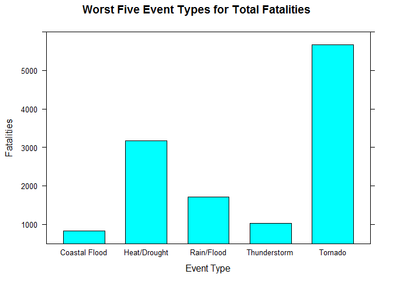
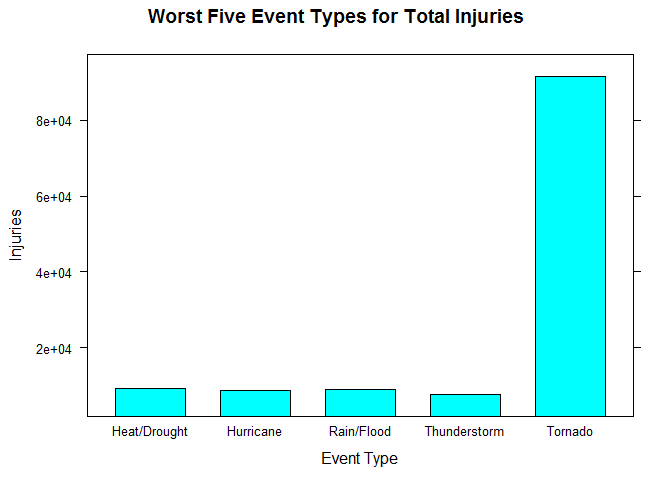

## Analysis of Severe Weather Events from NOAA Storm Database

### Synopsis

In this report United States severe weather event data for the years 1950 through 2011 from the NOAA Storm Database was analyzed to answer the following questions.

1. Which type of weather events are most harmful for population health?

2. Which type of weather events have the greatest economic consequences?

To answer these questions historical totals for fatalities, injuries, property damage and crop damage were calculated for different event types. The NOAA event types variable was collapsed to thirteen categories to simplify the analysis. The event types with the highest historical totals were considered to have the greatest negative impact.


### Data Processing

The data for this analysis was downloaded from the course website (see R code below for the URL). 

Documentation for the data file is available at:

https://d396qusza40orc.cloudfront.net/repdata%2Fpeer2_doc%2Fpd01016005curr.pdf

An FAQ for working with the data is available at:

https://d396qusza40orc.cloudfront.net/repdata%2Fpeer2_doc%2FNCDC%20Storm%20Events-FAQ%20Page.pdf

The data file was downloaded and unzipped. Then unused variables were removed from the file. The event type (EVTYPE) variable required cleaning since the categories did not have consistent cases. Also, there were extra spaces in some of the values. After cleaning, there were 898 distinct event types. Many of these types were redundant, and some were misspelled. The similar/redundant/misspelled categories were collapsed into a new variable called evtype2. The crosswalk between the two sets of categories is stored in a file called evtype2.csv. The crosswalk is available for inspecton at https://github.com/jvancampen/RepData_PeerAssessment2. The new categories were merged onto the file. All analysis used the new categories.


List of Collapsed Event Type Categories

* Coastal Flood (includes Tsunamis and High Surf)
* Cold/Ice/Frost
* Fire 
* Fog
* Hail
* Heat/Drought 
* Hurricane (includes Tropical Storms)
* Other
* Rain/Flood 
* Thunderstorm 
* Tornado (includes Waterspouts and Microbursts)
* Wind
* Winter Storm 

The property damage and crop damage exponent variables were also quite messy. New multiplier variables were created for both types of damage from their respective exponent data. The multipliers were used with the damage variables to create damage amounts in dollars for each event.


```r
## Set working directory if necessary
## setwd("your path here")
## setwd("C:\\Users\\liberty\\Documents\\James\\RepData\\RepData_PeerAssessment2")

## Download data file
# fileURL <- "https://d396qusza40orc.cloudfront.net/repdata%2Fdata%2FStormData.csv.bz2"
# download.file (fileURL, destfile=".\\stormdata.csv.bz2")

## Unzip data file
#install.packages("R.utils")
# library(R.utils)
# bunzip2(".\\stormdata.csv.bz2")

## Read into R and remove unneeded variables
sd1 <- read.csv(".\\stormdata.csv")
sd2 <- sd1[,c("BGN_DATE","STATE","EVTYPE","FATALITIES","INJURIES","PROPDMG",
              "PROPDMGEXP","CROPDMG","CROPDMGEXP")]

## Clean EVTYPE (event type) variable  to remove inconsistent cases and extra spaces
sd2$EVTYPE <- toupper(sd2$EVTYPE)
sd2$EVTYPE <- gsub("^ .", "", sd2$EVTYPE)
sd2$EVTYPE <- gsub(". $", "", sd2$EVTYPE)

## Read new event type categories and merge to data file
et2 <- read.csv(".\\evtype2.csv")
sd2 <- merge(sd2, et2, by="EVTYPE")

## Create property damage amount in dollars using exponent
## First create variable of multipliers from the exponent variable
sd2$propmult[sd2$PROPDMGEXP %in% c("","-","?","+","0")] <- 1
sd2$propmult[sd2$PROPDMGEXP %in% c("1","2","3","4","5","6","7","8")] <- 10^(as.numeric(sd2$PROPDMGEXP[sd2$PROPDMGEXP %in% c("1","2","3","4","5","6","7","8")])-5)
sd2$propmult[sd2$PROPDMGEXP %in% c("h","H")] <- 100
sd2$propmult[sd2$PROPDMGEXP %in% c("K")] <- 1000
sd2$propmult[sd2$PROPDMGEXP %in% c("m","M")] <- 1000000
sd2$propmult[sd2$PROPDMGEXP %in% c("B")] <- 1000000000
## Multiply prop damage by propmult to get damage in dollars 
sd2$propamt <- sd2$PROPDMG * sd2$propmult

## Create crop damage amount in dollars using exponent
## First create variable of multipliers from the exponent variable
sd2$cropmult[sd2$CROPDMGEXP %in% c("","?","0")] <- 1
sd2$cropmult[sd2$CROPDMGEXP %in% c("2")] <- 100
sd2$cropmult[sd2$CROPDMGEXP %in% c("k","K")] <- 1000
sd2$cropmult[sd2$CROPDMGEXP %in% c("m","M")] <- 1000000
sd2$cropmult[sd2$CROPDMGEXP %in% c("B")] <- 1000000000
## Multiply crop damage by cropmult to get damage in dollars 
sd2$cropamt <- sd2$CROPDMG * sd2$cropmult
```

### Analysis

This analysis looks at historical totals for population and economic damage from the different types of weather events. Note: The economic damage should be taken with a grain of salt since it does not appear that the amounts are adjusted for inflation


```r
########################################################################
## Sum fatalities by event type
fsum1 <- aggregate(sd2$FATALITIES, by=list(sd2$evtype2), FUN=sum, na.rm=T)
names(fsum1) <- c("evtype2", "cascount")

## Sum injuries by event type
isum1 <- aggregate(sd2$INJURIES, by=list(sd2$evtype2), FUN=sum, na.rm=T)
names(isum1) <- c("evtype2", "cascount")

## Sum property damage by event type
psum1 <- aggregate(sd2$propamt, by=list(sd2$evtype2), FUN=sum, na.rm=T)
names(psum1) <- c("evtype2", "dmg")

## Sum crop damage by event type
csum1 <- aggregate(sd2$cropamt, by=list(sd2$evtype2), FUN=sum, na.rm=T)
names(csum1) <- c("evtype2", "dmg")

## Sort historical totals by event type
fsum2 <- fsum1[order(fsum1$cascount, decreasing=TRUE),]
isum2 <- isum1[order(isum1$cascount, decreasing=TRUE),]
psum2 <- psum1[order(psum1$dmg, decreasing=TRUE),]
csum2 <- csum1[order(csum1$dmg, decreasing=TRUE),]
```

### Results

The following bar charts show the five worst event types (in terms of historical totals) for fatalities and injuries. By this measure the most dangerous events are tornados both interms of fatalities and injuries. The second most dangerous event type is extreme heat.

```r
## Create panel plot of 
library(lattice)
barchart(fsum2$cascount[1:5] ~ fsum2$evtype2[1:5], main="Worst Five Event Types for Total Fatalities", xlab="Event Type", ylab="Fatalities", drop.unused.levels = TRUE)
```

 

```r
barchart(isum2$cascount[1:5] ~ isum2$evtype2[1:5], main="Worst Five Event Types for Total Injuries", xlab="Event Type", ylab="Injuries", drop.unused.levels = TRUE)
```

 

The following tables show the five worst event types for property damage and crop damage. Rains and floods cause the most property damage followed by hurricanes. The events that cause the most crop damage are droughts followed by floods.

Property Damage in Dollars

```r
print(psum2[1:5,c("evtype2","dmg")])
```

```
##          evtype2       dmg
## 9     Rain/Flood 1.714e+11
## 7      Hurricane 9.761e+10
## 11       Tornado 5.862e+10
## 1  Coastal Flood 4.868e+10
## 5           Hail 1.598e+10
```

Crop Damage in Dollars

```r
print(csum2[1:5,c("evtype2","dmg")])
```

```
##           evtype2       dmg
## 6    Heat/Drought 1.488e+10
## 9      Rain/Flood 1.336e+10
## 7       Hurricane 6.830e+09
## 13   Winter Storm 5.382e+09
## 2  Cold/Ice/Frost 3.363e+09
```
### Conclusion
Historically, the biggest danger to the population comes from tornadoes, likely because they form quickly, and it is difficult to provide adequate warning. The biggest economic problems are caused by either too much or too little water. Droughts and floods typically affect a much larger area than might be struck by tornados. Thus, they can have a much larger economic impact.

